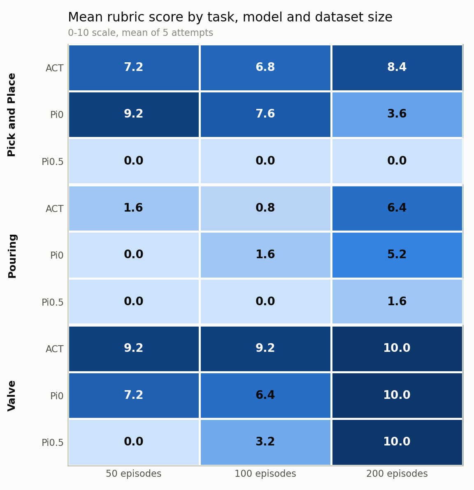
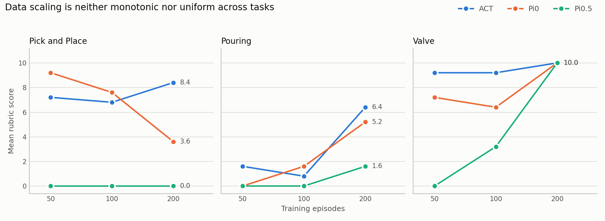
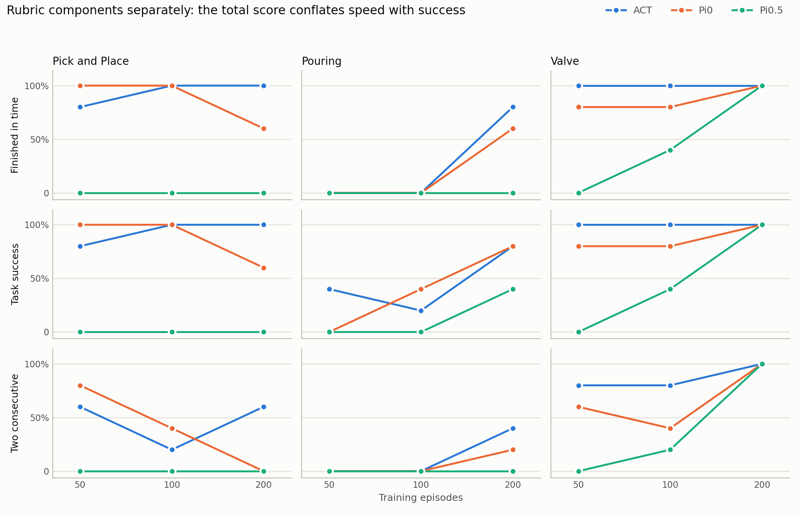
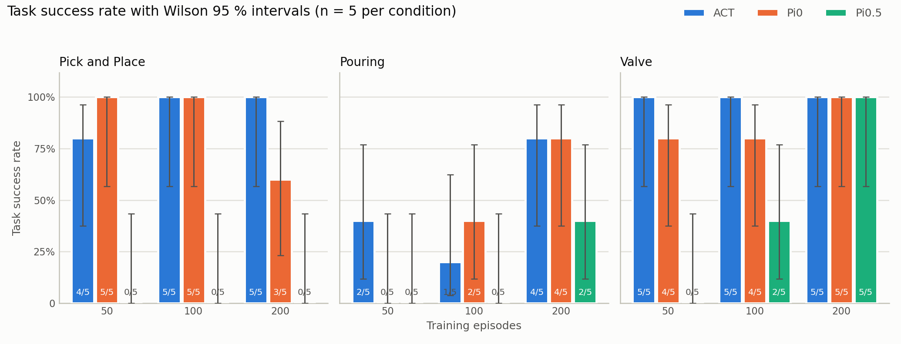
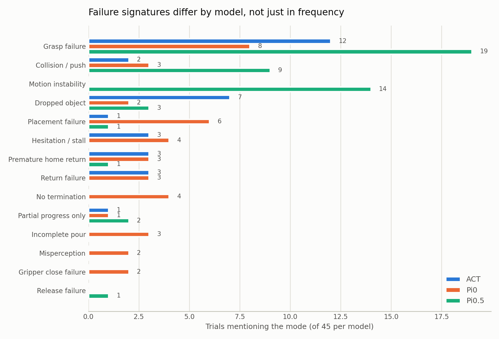

# Evaluation scores — trends across task, model and dataset size

Analysis of the 135 scored trials in [`data.xlsx`](../../data.xlsx): 3 tasks ×
3 models × 3 dataset sizes × 5 attempts. The workbook's `Summary` sheet carries
only mean / SD / CV per condition; this document adds the component rates, the
failure-mode breakdown and the confounds. Registered as gh #140.

- Regenerate: `python claude_test/eval_score_analysis.py`
- Machine-readable: [`trials.csv`](trials.csv) (135 rows),
  [`conditions.csv`](conditions.csv) (27 rows), [`tables.md`](tables.md)
- The workbook is never written to. The scoring defects in it stay open as #132.

## 1. Method, and what it changes from the `Summary` sheet

The rubric printed on every raw sheet is `2 × finished-in-time + 4 × task-success
+ 4 × two-consecutive-successes`, so a trial can only score 0, 4, 6 or 10. Two
things follow that the `Summary` sheet does not account for.

**Every total is recomputed from its own booleans.** Two of the 135 rows store a
total that its own checkboxes do not produce:

| Sheet | Row | Condition | Stored | Rubric | Note |
|---|---|---|---|---|---|
| `Pouring` | 35 | Pi0 / 200 / 5회차 | 6 | **4** | `병을 반납 못함, 다 부었지만 계속 부어 복귀 못함` |
| `밸브 조작` | 42 | Pi0.5 / 100 / 2회차 | 10 | **6** | `간신히 넣음 밸브를 찍음` — `2회 연속 성공` is False |

The first is already tracked as #132; the second is new, entered with the Pi0.5
rows. Correcting them moves two published means: Pouring Pi0 @200 `5.6 → 5.2`
and Valve Pi0.5 @100 `4.0 → 3.2`. Every other condition reproduces the `Summary`
sheet exactly, which the script asserts on each run.

**The coefficient of variation is dropped.** On a four-valued ordinal scale over
n=5 the CV is not a meaningful dispersion measure — it is undefined for the ten
all-zero conditions and reads 223.6 % for Pouring ACT @100, a condition with one
success in five. Component rates with **Wilson 95 % intervals** replace it; Wilson
stays defined at 0/5 and 5/5.

**n = 5 per condition.** The interval on 5/5 is 57–100 % and on 0/5 is 0–43 %.
Nothing below is a significance claim; single-condition gaps of one or two
attempts are inside the noise. The trends that follow are the ones that repeat
across conditions.

## 2. Task difficulty dominates everything else

Pooled over all models and dataset sizes:

| Task | Task success | Mean score |
|---|---|---|
| Valve (`task3`) | 35/45 — 78 % | 7.24 |
| Pick and Place (`task1`) | 27/45 — 60 % | 4.76 |
| Pouring (`task2`) | 15/45 — 33 % | 1.91 |

The ordering holds inside every model. Pouring is the only task no model solves
at 50 episodes (0/15 in-time completions across all three models), and the only
one where no model reaches a 5/5 success rate at any dataset size. It is also the
task with the longest measured attempts — the video report gives 86.2 ± 41.0 s
mean for `task2_act_200` against 32.1 ± 5.2 s for `task3_act_200` — so its
difficulty shows up as duration as well as failure.

## 3. Data scaling is neither monotonic nor uniform

Pooled, more data helps: 44 % → 53 % → 73 % task success at 50 → 100 → 200
episodes. Per model and task it is far less orderly.

- **ACT** dips at 100 episodes on two of three tasks (Pick and Place 7.2 → 6.8,
  Pouring 1.6 → 0.8) and recovers at 200. It is the least data-hungry of the
  three: it already scores 9.2 on the valve at 50 episodes.
- **Pi0 regresses on Pick and Place**, 9.2 → 7.6 → **3.6**, and it is a real
  capability drop, not a timing artefact — task success falls 5/5 → 5/5 → 3/5 and
  two-consecutive falls 4/5 → 2/5 → **0/5**. The 200-episode notes name a
  mechanism the 50-episode notes never do: `그리퍼를 못 닫음` ("the gripper will
  not close") twice, and `병을 못넘 2` ("failed to place it, both tries") twice.
  This is the single clearest anomaly in the dataset and the one worth
  re-running.
- **Pi0.5 shows a threshold, not a slope.** On the valve it goes 0.0 → 3.2 →
  **10.0**: nothing at 50 episodes, half-working at 100, then a clean 5/5 with
  5/5 two-consecutive at 200. Pouring hints at the same shape one step later
  (0 → 0 → 1.6).

**At 200 episodes the valve task is saturated for all three models** — ACT, Pi0
and Pi0.5 all score 10.0 with 5/5 two-consecutive. Any comparison between models
on that cell is measuring the ceiling, not the models.

## 4. The total score conflates speed with success

Splitting the rubric shows the time-limit term only ever bites on one task. The
`180초 내 완료` flag equals the `작업 성공` flag on **all 90** Pick and Place and
Valve trials, and diverges on **8 of 45** Pouring trials — always in the same
direction, success recorded without completion. No trial anywhere is marked
in-time while unsuccessful.

The practical consequence is that a low Pouring score at 50 or 100 episodes
means "did not finish", not "did not succeed at all": ACT @50 succeeded 2/5 and
ACT @100 succeeded 1/5 while both are **0/5** in-time, on notes like
`병을 집기만 함, 병을 반납 못함` ("only picked the bottle up, could not return
it"). Reading the 1.6 and 0.8 means as near-total failure overstates it. On Pick
and Place @200 the Pi0 drop carries no such qualification — in-time and success
fall together, so it is a genuine failure.

**Which time limit is in force is unresolved.** The criteria banner on the raw
sheets still reads `40초` / `40초` / `60초` while the column header on all three
reads `180초 내 완료`, and ToDo records that the Pick and Place criterion was
moved from 60 s to 180 s mid-way. The measured durations do not settle it: no
condition is marked in-time with *every* attempt over the banner limit, but eight
conditions are marked 5/5 in-time while carrying an attempt well past it —
`task3_act_100` was scored 5/5 with a 114 s attempt against a 40 s banner. Since
the video report does not say which attempt belongs to which 회차, both readings
survive. The flag is best read as "completed the task", and the banner rows
should be corrected to 180 s or the flags re-scored.

## 5. Failure signatures differ by model

Keyword classification of the 100 non-empty `비고` notes. A note may carry several
modes, so these are labels rather than bins; two fragments matched no rule and are
listed by the script for audit.

| Failure mode | ACT | Pi0 | Pi0.5 |
|---|---|---|---|
| Grasp failure | 12 | 8 | **19** |
| Motion instability | 0 | 0 | **14** |
| Collision / push | 2 | 3 | **9** |
| Dropped object | **7** | 2 | 3 |
| Placement failure | 1 | **6** | 1 |
| No termination | 0 | **4** | 0 |
| Hesitation / stall | 3 | 4 | 0 |
| Premature home return | 3 | 3 | 1 |
| Return failure | 3 | 3 | 0 |
| Incomplete pour | 0 | 3 | 0 |
| Misperception | 0 | 2 | 0 |
| Gripper close failure | 0 | **2** | 0 |
| Release failure | 0 | 0 | 1 |

Each model fails in its own way, and that is more actionable than the ranking:

- **ACT drops what it has already grasped** — 6 of its 7 drop trials are
  `중간에 병을 떨어트림` ("dropped the bottle midway"), all seven on Pick and
  Place and four of them at 100 episodes, where ACT succeeded 5/5 yet scored only
  6.8 because the second try kept failing.
- **Pi0 does not know when to stop.** `다 부었지만 계속 부음` ("finished pouring
  but kept pouring") and `다 부었지만 계속 부어 복귀 못함` account for all four
  no-termination mentions, all on Pouring. Its other signature is the gripper:
  `그리퍼를 못 닫음`, twice, only at Pick and Place @200.
- **Pi0.5 fails before it reaches the object.** `모션이 튐` ("the motion jitters")
  and `아예 진동만함` ("it only vibrates in place") appear in 14 trials, and no
  other model has a single one. Its grasp and collision counts are inflated by the
  same cause — the arm is unstable, so it hits or pushes rather than grasps.

Six trials are annotated `무효` (invalid — an operator or rig event) but were
scored anyway; five of them landed on Pi0 and Pi0.5 conditions. They are listed
in the script output. Rig and operator events (`재부팅`, `수리함`, `카메라선 손상`)
are tagged separately and excluded from the failure counts above.

## 6. Confounds — cells that must not be read as capability

Two blocks of the grid measure the rig rather than the policy.

**Pick and Place × Pi0.5, all three dataset sizes (0.0 / 0.0 / 0.0).** This is the
open subject of #135. The recorded symptom is `아예 진동만함` — the arm does not
move at all, or only trembles in place — and the investigation has already ruled
out training health (all three runs converged, loss 0.005 at 24 K steps),
normalization statistics, the follower ramp limiter, and the SSH link. The leading
hypothesis is that Pi0.5 reads robot state as 32 coarse tokens over [-1, 1] with
25–29 % of values saturated, which is fatal on `task1` specifically because there
the commanded action is only 1.23° from the current state — against 20.02° on
`task2` and 7.61° on `task3`. **Reading this column as "Pi0.5 cannot do pick and
place" is not supported.** Pi0.5 scores a clean 10.0 on the valve at the same
episode count.

**Valve × Pi0.5 @50 (0.0).** Recorded in the same late session, with
`노파심에 카메라 재부팅함` ("rebooted the camera out of caution") in one trial, and
the `task3_pi05_50_half*` recordings post-date the 22:14 camera move that #135 is
still trying to date. Treat as not comparable until the PTZ preset is confirmed.

Excluding those cells, Pi0.5's task success rate goes from 9/45 (20 %) to 9/25
(36 %). The remaining ordering — ACT 80 %, Pi0 71 % — is unaffected by either.

## 7. What to do next

1. **Re-run Pick and Place × Pi0 @200.** The 9.2 → 3.6 regression is the one
   result with no environmental explanation on file, and the gripper-close notes
   point at something checkable in the action pipeline.
2. **Re-run the two confounded Pi0.5 blocks** after #135 closes, so the model
   comparison rests on 27 valid conditions rather than 23.
3. **Fix the workbook** — the two rubric rows in §1, the `40초` / `60초` criteria
   banners that contradict the `180초` header, and the `학습시간 (h)` block whose
   third column is labelled `DS 150` where the dataset is 200.
4. **Raise n above 5** for any condition meant to support a published claim. At
   n=5 a 5/5 and a 3/5 have overlapping Wilson intervals.
5. **Decide whether `무효` trials count.** Six are currently scored as if valid.
